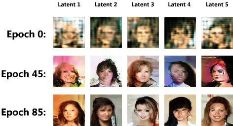
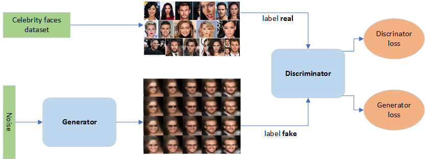

# CelebGANTensorflow

A Generative Adversarial Model (GAN) for generating new celebrity faces, trained on the CelebA dataset.

*Figure 1: Results from this model over training time.*

*Figure 2: GAN model schematic for generating celebrity faces (Kana, 2020).*

